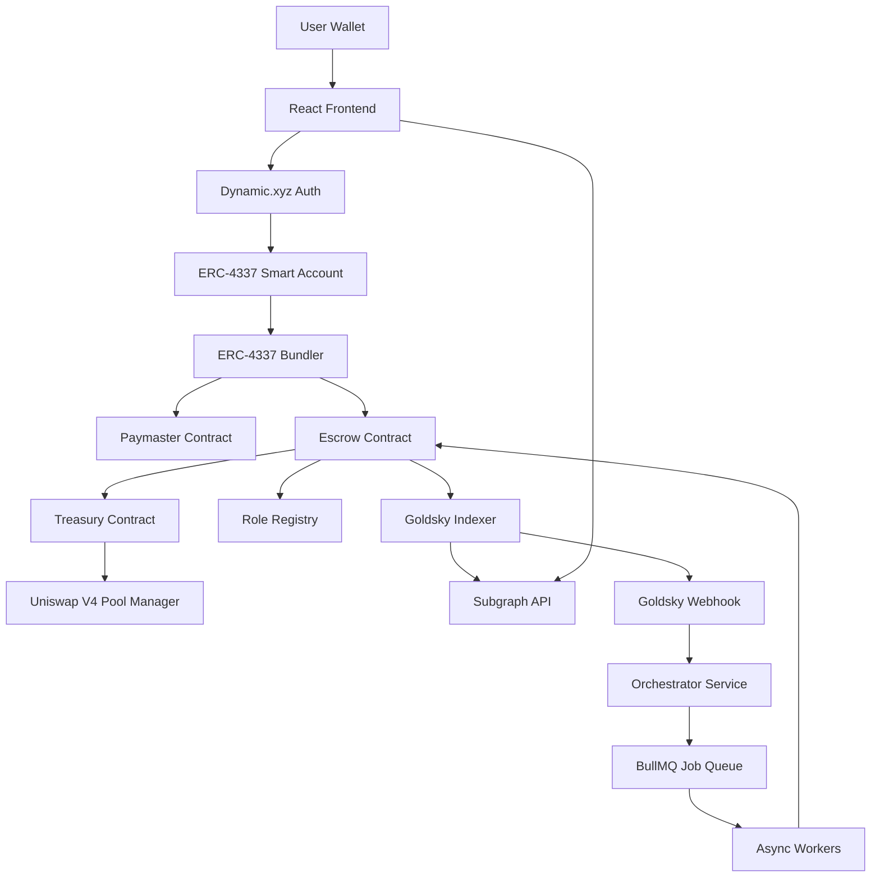
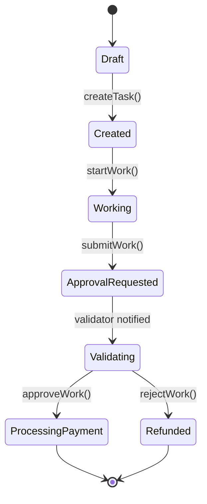

# Design Document: ContractSafe MVP

## Overview

ContractSafe is an event-driven escrow system that combines on-chain deterministic state management with off-chain asynchronous workflows. The architecture follows an event-sourcing pattern where smart contracts emit events for every state transition, which are indexed by Goldsky and streamed to off-chain services via webhooks. This design enables human validators, AI agents, and oracle-based verification to operate asynchronously while maintaining transparency and auditability.

The system is built on **Polygon** for escrow management and payment splitting (leveraging lower gas costs), with **Uniswap v4** integration for cross-chain token conversion and distribution. Contributors and validators can specify their preferred chain and token, and the system automatically converts and bridges funds to their chosen destination. All user interactions are gasless via ERC-4337 account abstraction with Paymaster sponsorship.

### Multi-Chain Payment Architecture

**Escrow Layer (Polygon):**

- All tasks are created and managed on Polygon
- Escrow funds are locked on Polygon
- Payment splitting calculations occur on Polygon
- Lower gas costs for task management operations

**Funding Flow (Any Chain → Polygon):**

- Task creators can fund escrow from any supported chain (Ethereum, Arbitrum, Optimism, Base, etc.)
- **Creator's original token is respected** - no forced conversion on source chain
- LayerZero bridges creator's token (ETH, DAI, USDC, WBTC, etc.) from source chain to Polygon
- **Uniswap v4 on Polygon converts bridged token → MATIC** for escrow locking
- Escrow contract on Polygon locks MATIC
- Creator never needs to manually bridge or hold MATIC

**Example:** Creator on Ethereum with ETH → LayerZero bridges ETH to Polygon → Uniswap v4 swaps ETH to MATIC → MATIC locked in escrow

**Distribution Layer (Polygon → Any Chain):**

- Uniswap v4 on Polygon converts MATIC to desired tokens
- LayerZero bridges tokens to recipient's preferred chain
- Recipients specify: target chain (Ethereum, Arbitrum, Optimism, Base, etc.) and token (ETH, USDC, DAI, etc.)
- Automatic routing through optimal bridge providers

**Complete Flow Example:**

1. Creator on Ethereum wants to create task with 1 ETH escrow
2. LayerZero bridges 1 ETH from Ethereum to Polygon
3. **Uniswap v4 on Polygon swaps ETH → MATIC** (for escrow locking)
4. Task created on Polygon with escrowed MATIC
5. Work completed and approved
6. **Uniswap v4 on Polygon swaps MATIC → recipient's desired tokens** (USDC, DAI, etc.)
7. LayerZero bridges tokens to recipient's chosen chains
8. Recipients receive funds on their preferred chains in their preferred tokens

**Key Point:** Uniswap v4 is used at TWO stages (both on Polygon):

- **Stage 1 (Polygon)**: Convert bridged token → MATIC for escrow locking
- **Stage 2 (Polygon)**: Convert MATIC → recipient's desired tokens for payout

## Architecture

### Monorepo Folder Structure

```
contract-safe/
├── contract/                      # Smart contracts (Hardhat v3)
│   ├── contracts/
│   │   ├── ContractFactory.sol    # Factory for deploying contract suite
│   │   ├── EscrowContract.sol
│   │   ├── Treasury.sol
│   │   ├── RoleRegistry.sol
│   │   ├── Paymaster.sol
│   │   ├── hooks/
│   │   │   └── EscrowPaymentHook.sol
│   │   └── interfaces/
│   │       ├── IEscrow.sol
│   │       ├── ITreasury.sol
│   │       ├── IRoleRegistry.sol
│   │       └── IContractFactory.sol
│   ├── test/
│   │   ├── ContractFactory.t.sol  # Factory tests
│   │   ├── EscrowContract.t.sol   # Solidity property tests
│   │   ├── Treasury.t.sol
│   │   ├── Paymaster.t.sol
│   │   └── integration/
│   │       └── task-lifecycle.test.ts
│   ├── scripts/
│   │   ├── deploy.js              # Uses ContractFactory
│   │   └── verify.js
│   ├── hardhat.config.ts
│   ├── package.json
│   └── README.md
│
├── web/                           # React frontend
│   ├── src/
│   │   ├── components/
│   │   │   ├── auth/
│   │   │   │   └── LoginButton.tsx
│   │   │   ├── tasks/
│   │   │   │   ├── TaskCard.tsx
│   │   │   │   ├── TaskActions.tsx
│   │   │   │   ├── CreateTaskForm.tsx
│   │   │   │   ├── SubmitWorkForm.tsx
│   │   │   │   └── StateVisualization.tsx
│   │   │   ├── layout/
│   │   │   │   ├── Header.tsx
│   │   │   │   ├── Footer.tsx
│   │   │   │   └── Sidebar.tsx
│   │   │   └── common/
│   │   │       ├── Button.tsx
│   │   │       ├── Card.tsx
│   │   │       ├── Modal.tsx
│   │   │       └── Toast.tsx
│   │   ├── views/
│   │   │   ├── LoginPage.tsx
│   │   │   ├── TaskListPage.tsx
│   │   │   ├── TaskDetailPage.tsx
│   │   │   ├── CreateTaskPage.tsx
│   │   │   └── NotFoundPage.tsx
│   │   ├── router/
│   │   │   ├── index.tsx
│   │   │   ├── ProtectedRoute.tsx
│   │   │   └── routes.ts
│   │   ├── hooks/
│   │   │   ├── useAuth.ts
│   │   │   ├── useTask.ts
│   │   │   ├── useContract.ts
│   │   │   └── useResponsive.ts
│   │   ├── lib/
│   │   │   ├── contracts.ts
│   │   │   ├── graphql.ts
│   │   │   └── dynamic.ts
│   │   ├── utils/
│   │   │   ├── validation.ts
│   │   │   └── formatting.ts
│   │   ├── contracts/
│   │   │   └── addresses.json
│   │   ├── App.tsx
│   │   └── main.tsx
│   ├── public/
│   │   └── logo.svg
│   ├── package.json
│   ├── vite.config.ts
│   ├── tailwind.config.js
│   ├── Dockerfile
│   └── README.md
│
├── api/                           # Go orchestrator service
│   ├── cmd/
│   │   └── server/
│   │       └── main.go
│   ├── internal/
│   │   ├── orchestrator/
│   │   │   ├── orchestrator.go
│   │   │   ├── orchestrator_test.go
│   │   │   ├── event.go
│   │   │   └── deduplication.go
│   │   ├── webhook/
│   │   │   ├── handler.go
│   │   │   ├── handler_test.go
│   │   │   └── validator.go
│   │   ├── queue/
│   │   │   ├── bullmq.go
│   │   │   └── jobs.go
│   │   ├── blockchain/
│   │   │   ├── client.go
│   │   │   └── transactions.go
│   │   └── database/
│   │       ├── postgres.go
│   │       └── migrations/
│   ├── pkg/
│   │   └── proto/
│   │       ├── task.proto
│   │       └── generated/
│   ├── go.mod
│   ├── go.sum
│   ├── Dockerfile
│   └── README.md
│
├── example_agent/                 # Example MCP agent for task validation
│   ├── src/
│   │   ├── index.ts               # MCP server entry point
│   │   ├── tools/
│   │   │   ├── evaluate-submission.ts
│   │   │   └── check-requirements.ts
│   │   ├── prompts/
│   │   │   └── validation-prompt.ts
│   │   └── types.ts
│   ├── package.json
│   ├── tsconfig.json
│   └── README.md
│
├── script/                        # Build and utility scripts
│   ├── generate_protobuf
│   ├── deploy_all.sh
│   └── setup_dev.sh
│
├── subgraph/                      # Goldsky subgraph configuration
│   ├── schema.graphql
│   ├── subgraph.yaml
│   ├── src/
│   │   ├── mapping.ts
│   │   └── utils.ts
│   └── README.md
│
├── docker-compose.yml
├── .env.example
├── .gitignore
├── LICENSE
└── README.md
```

### Component Responsibilities

**contract/**: Smart contract development and testing

- Solidity contracts for escrow, treasury, roles, and paymaster
- Hardhat v3 configuration with native Solidity tests
- Deployment and verification scripts
- Integration tests in TypeScript

**web/**: User-facing React application

- Dynamic.xyz authentication integration
- Task management UI (create, view, submit, approve/reject)
- Real-time state updates via subgraph polling
- Tailwind CSS styling
- Vite for fast development and building

**api/**: Go-based orchestrator service

- Webhook receiver for Goldsky events
- Event validation and deduplication
- Job routing to BullMQ
- gRPC API for internal services
- PostgreSQL for event deduplication storage

**script/**: Build automation and utilities

- Protobuf generation for Go services
- Deployment orchestration scripts
- Development environment setup

**subgraph/**: Goldsky indexing configuration

- GraphQL schema definition
- Event mapping handlers
- Subgraph deployment configuration

### High-Level Components



### Technology Stack

**Blockchain:**

- Primary Chain: Polygon (escrow, state management, payment splitting)
- Supported Destination Chains: Ethereum, Arbitrum, Optimism, Base, Polygon zkEVM
- Cross-Chain Bridges: LayerZero, Axelar, or Connext for multi-chain delivery

**Smart Contracts:**

- Development Framework: Hardhat v3
- Language: Solidity 0.8.x
- Testing: Hardhat v3 native Solidity tests + TypeScript integration tests
- Account Abstraction: ERC-4337 (EntryPoint, Smart Accounts, Paymaster)
- Token Distribution: Uniswap v4 with custom hooks
- Cross-Chain: LayerZero OFT or equivalent for bridging

**Indexing & Events:**

- Indexer: Goldsky
- Event Streaming: Goldsky Webhooks
- Query Layer: GraphQL Subgraph

**Backend Services:**

- Orchestrator: Go
- Job Queue: BullMQ (Redis-backed)
- API: gRPC with Protocol Buffers

**Frontend:**

- Framework: React with React Router
- Styling: Tailwind CSS
- Wallet/Auth: Dynamic.xyz
- State Management: URL-driven + Subgraph queries

**Infrastructure:**

- Containerization: Docker
- Orchestration: Docker Compose
- Monorepo Structure: contract / web / api / script

## Components and Interfaces

### Smart Contracts

#### Contract Factory

The ContractFactory is responsible for deploying all necessary contracts for the ContractSafe system and managing their initialization.

**ContractFactory.sol:**

```solidity
pragma solidity ^0.8.20;

import "./EscrowContract.sol";
import "./Treasury.sol";
import "./RoleRegistry.sol";
import "./Paymaster.sol";

contract ContractFactory {
    event ContractSuiteDeployed(
        address indexed deployer,
        address escrow,
        address treasury,
        address roleRegistry,
        address paymaster,
        uint256 timestamp
    );

    event ContractInitialized(
        address indexed contractAddress,
        string contractType,
        uint256 timestamp
    );

    struct DeployedContracts {
        address escrow;
        address treasury;
        address roleRegistry;
        address paymaster;
        uint256 deployedAt;
    }

    mapping(address => DeployedContracts) public deployments;

    function deployContractSuite(
        address admin,
        address entryPoint
    ) external returns (DeployedContracts memory) {
        // Deploy RoleRegistry first
        RoleRegistry roleRegistry = new RoleRegistry(admin);
        emit ContractInitialized(address(roleRegistry), "RoleRegistry", block.timestamp);

        // Deploy Treasury
        Treasury treasury = new Treasury();
        emit ContractInitialized(address(treasury), "Treasury", block.timestamp);

        // Deploy Paymaster
        Paymaster paymaster = new Paymaster(entryPoint, admin);
        emit ContractInitialized(address(paymaster), "Paymaster", block.timestamp);

        // Deploy Escrow with references to other contracts
        EscrowContract escrow = new EscrowContract(
            address(treasury),
            address(roleRegistry),
            address(paymaster)
        );
        emit ContractInitialized(address(escrow), "EscrowContract", block.timestamp);

        // Grant necessary roles
        roleRegistry.grantRole(address(escrow), keccak256("ESCROW_ROLE"));

        // Set escrow as authorized caller on treasury
        treasury.setAuthorizedCaller(address(escrow), true);

        // Store deployment info
        DeployedContracts memory deployed = DeployedContracts({
            escrow: address(escrow),
            treasury: address(treasury),
            roleRegistry: address(roleRegistry),
            paymaster: address(paymaster),
            deployedAt: block.timestamp
        });

        deployments[msg.sender] = deployed;

        emit ContractSuiteDeployed(
            msg.sender,
            address(escrow),
            address(treasury),
            address(roleRegistry),
            address(paymaster),
            block.timestamp
        );

        return deployed;
    }

    function getDeployment(address deployer) external view returns (DeployedContracts memory) {
        return deployments[deployer];
    }
}
```

#### CrossChainFunding Contract (Multi-Chain Deployment)

Deployed on all supported chains (Ethereum, Arbitrum, Optimism, Base) to handle escrow funding from any chain to Polygon.

**Key Functions:**

```solidity
contract CrossChainFunding {
    IPoolManager public uniswapPoolManager;
    ILayerZeroEndpoint public layerZeroEndpoint;
    uint16 public constant POLYGON_CHAIN_ID = 109; // LayerZero Polygon chain ID
    address public polygonEscrowAddress;

    event FundingInitiated(
        address indexed creator,
        uint256 amount,
        address sourceToken,
        uint256 destinationChainId,
        bytes32 taskIdentifier
    );

    function fundTaskCrossChain(
        address sourceToken,
        uint256 amount,
        address contributor,
        address validator,
        uint8 contributorPercentage,
        uint8 validatorPercentage,
        string calldata descriptionHash,
        PaymentPreference calldata contributorPref,
        PaymentPreference calldata validatorPref
    ) external payable {
        // Step 1: Swap source token to bridgeable asset (USDC) on source chain
        uint256 bridgeableAmount = _swapToBridgeable(sourceToken, amount);

        // Step 2: Encode task creation parameters
        bytes memory payload = abi.encode(
            msg.sender, // creator
            contributor,
            validator,
            contributorPercentage,
            validatorPercentage,
            descriptionHash,
            contributorPref,
            validatorPref,
            bridgeableAmount
        );

        // Step 3: Bridge to Polygon via LayerZero
        layerZeroEndpoint.send{value: msg.value}(
            POLYGON_CHAIN_ID,
            abi.encodePacked(polygonEscrowAddress),
            payload,
            payable(msg.sender),
            address(0),
            ""
        );

        emit FundingInitiated(
            msg.sender,
            amount,
            sourceToken,
            POLYGON_CHAIN_ID,
            keccak256(payload)
        );
    }

    function _swapToBridgeable(
        address sourceToken,
        uint256 amount
    ) internal returns (uint256 bridgeableAmount) {
        // CRITICAL: Use Uniswap v4 to convert ANY token to USDC for bridging
        // This enables creators to pay in ETH, DAI, WBTC, or any other token
        // Uniswap v4 provides optimal routing and pricing
        address USDC = getUSDCAddress();

        if (sourceToken == USDC) {
            return amount; // Already in bridgeable asset, no swap needed
        }

        // Swap via Uniswap v4
        PoolKey memory key = PoolKey({
            currency0: Currency.wrap(sourceToken),
            currency1: Currency.wrap(USDC),
            fee: 3000,
            tickSpacing: 60,
            hooks: IHooks(address(0))
        });

        IPoolManager.SwapParams memory params = IPoolManager.SwapParams({
            zeroForOne: true,
            amountSpecified: int256(amount),
            sqrtPriceLimitX96: 0
        });

        BalanceDelta delta = uniswapPoolManager.swap(key, params, "");
        bridgeableAmount = uint256(int256(-delta.amount1()));
    }

    function getUSDCAddress() internal view returns (address) {
        // Return USDC address for current chain
        if (block.chainid == 1) return 0xA0b86991c6218b36c1d19D4a2e9Eb0cE3606eB48; // Ethereum
        if (block.chainid == 42161) return 0xaf88d065e77c8cC2239327C5EDb3A432268e5831; // Arbitrum
        if (block.chainid == 10) return 0x0b2C639c533813f4Aa9D7837CAf62653d097Ff85; // Optimism
        if (block.chainid == 8453) return 0x833589fCD6eDb6E08f4c7C32D4f71b54bdA02913; // Base
        revert("Unsupported chain");
    }
}
```

#### Escrow Contract

The core contract managing task lifecycle and fund custody.

**State Variables:**

```solidity
struct PaymentPreference {
    uint256 destinationChainId; // LayerZero chain ID
    address tokenAddress;        // Desired token on destination chain
    address recipientAddress;    // Recipient address on destination chain
}

struct Task {
    uint256 taskId;
    address creator;
    address contributor;
    address validator;
    uint256 escrowAmount;
    uint8 contributorPercentage;
    uint8 validatorPercentage;
    TaskState state;
    string descriptionHash; // IPFS hash
    string artifactsHash;   // IPFS hash
    uint256 createdAt;
    uint256 updatedAt;
}

enum TaskState {
    Draft,
    Created,
    Working,
    ApprovalRequested,
    Validating,
    ProcessingPayment,
    Refunded
}

mapping(uint256 => Task) public tasks;
mapping(uint256 => PaymentPreference) public contributorPaymentPrefs;
mapping(uint256 => PaymentPreference) public validatorPaymentPrefs;
uint256 public nextTaskId;
```

**Key Functions:**

```solidity
function createTask(
    address contributor,
    address validator,
    uint8 contributorPercentage,
    uint8 validatorPercentage,
    string calldata descriptionHash,
    PaymentPreference calldata contributorPref,
    PaymentPreference calldata validatorPref
) external payable returns (uint256 taskId);
    uint8 validatorPercentage,
    string calldata descriptionHash
) external payable returns (uint256 taskId);

function startWork(uint256 taskId) external;

function submitWork(uint256 taskId, string calldata artifactsHash) external;

function approveWork(uint256 taskId) external;

function rejectWork(uint256 taskId) external;

function processPayment(uint256 taskId) internal;

function refund(uint256 taskId) internal;

// LayerZero receive function for cross-chain task creation
function lzReceive(
    uint16 _srcChainId,
    bytes memory _srcAddress,
    uint64 _nonce,
    bytes memory _payload
) external;
```

**Cross-Chain Task Creation:**

```solidity
// Called by LayerZero when funds arrive from another chain
function lzReceive(
    uint16 _srcChainId,
    bytes memory _srcAddress,
    uint64 _nonce,
    bytes memory _payload
) external override {
    require(msg.sender == address(layerZeroEndpoint), "Only LayerZero");

    // Decode task creation parameters
    (
        address creator,
        address contributor,
        address validator,
        uint8 contributorPercentage,
        uint8 validatorPercentage,
        string memory descriptionHash,
        PaymentPreference memory contributorPref,
        PaymentPreference memory validatorPref,
        uint256 bridgedAmount
    ) = abi.decode(_payload, (address, address, address, uint8, uint8, string, PaymentPreference, PaymentPreference, uint256));

    // Convert bridged USDC to MATIC on Polygon
    uint256 maticAmount = _swapToMatic(bridgedAmount);

    // Create task with bridged funds
    uint256 taskId = _createTaskInternal(
        creator,
        contributor,
        validator,
        contributorPercentage,
        validatorPercentage,
        descriptionHash,
        contributorPref,
        validatorPref,
        maticAmount
    );

    emit CrossChainTaskCreated(taskId, _srcChainId, creator, maticAmount);
}

function _swapToMatic(uint256 usdcAmount) internal returns (uint256 maticAmount) {
    address USDC = 0x2791Bca1f2de4661ED88A30C99A7a9449Aa84174; // Polygon USDC

    // Swap USDC to MATIC via Uniswap v4
    PoolKey memory key = PoolKey({
        currency0: Currency.wrap(USDC),
        currency1: Currency.wrap(address(0)), // MATIC
        fee: 3000,
        tickSpacing: 60,
        hooks: IHooks(address(0))
    });

    IPoolManager.SwapParams memory params = IPoolManager.SwapParams({
        zeroForOne: true,
        amountSpecified: int256(usdcAmount),
        sqrtPriceLimitX96: 0
    });

    BalanceDelta delta = uniswapPoolManager.swap(key, params, "");
    maticAmount = uint256(int256(-delta.amount1()));
}
```

**Events:**

```solidity
event TaskCreated(uint256 indexed taskId, address indexed creator, address contributor, address validator, uint256 escrowAmount);
event TaskWorkingStarted(uint256 indexed taskId, address indexed contributor);
event ApprovalRequested(uint256 indexed taskId, string artifactsHash);
event ValidationStarted(uint256 indexed taskId, address indexed validator);
event TaskApproved(uint256 indexed taskId, address indexed validator);
event TaskRejected(uint256 indexed taskId, address indexed validator);
event PaymentProcessed(uint256 indexed taskId, address contributor, uint256 contributorAmount, address validator, uint256 validatorAmount);
event TaskRefunded(uint256 indexed taskId, address creator, uint256 amount);
```

#### Treasury Contract

Manages fund custody and distribution on Polygon, with Uniswap v4 integration for token swaps and cross-chain bridging for multi-chain delivery.

**Key Functions:**

```solidity
function depositEscrow(uint256 taskId) external payable;

function releasePayment(
    uint256 taskId,
    address contributor,
    uint256 contributorAmount,
    address validator,
    uint256 validatorAmount
) external onlyEscrow;

function refundCreator(uint256 taskId, address creator, uint256 amount) external onlyEscrow;

function swapAndBridge(
    uint256 taskId,
    PaymentPreference calldata contributorPref,
    uint256 contributorAmount,
    PaymentPreference calldata validatorPref,
    uint256 validatorAmount
) external onlyEscrow;
```

**Cross-Chain Payment Flow:**

The Treasury orchestrates a multi-step process for cross-chain payments:

1. **Swap on Polygon**: Use Uniswap v4 to convert MATIC to desired tokens
2. **Bridge to Destination**: Use LayerZero to bridge tokens to recipient's chain
3. **Deliver to Recipient**: Tokens arrive at recipient's address on their chosen chain

```solidity
interface ILayerZeroEndpoint {
    function send(
        uint16 _dstChainId,
        bytes calldata _destination,
        bytes calldata _payload,
        address payable _refundAddress,
        address _zroPaymentAddress,
        bytes calldata _adapterParams
    ) external payable;
}

contract Treasury {
    IPoolManager public uniswapPoolManager;
    ILayerZeroEndpoint public layerZeroEndpoint;

    function swapAndBridge(
        uint256 taskId,
        PaymentPreference calldata contributorPref,
        uint256 contributorAmount,
        PaymentPreference calldata validatorPref,
        uint256 validatorAmount
    ) external onlyEscrow {
        // Step 1: Swap MATIC to desired tokens on Polygon
        uint256 contributorTokenAmount = _swapOnUniswap(
            contributorAmount,
            contributorPref.tokenAddress
        );

        uint256 validatorTokenAmount = _swapOnUniswap(
            validatorAmount,
            validatorPref.tokenAddress
        );

        // Step 2: Bridge to destination chains
        if (contributorPref.destinationChainId != block.chainid) {
            _bridgeToChain(
                taskId,
                contributorPref.destinationChainId,
                contributorPref.tokenAddress,
                contributorPref.recipientAddress,
                contributorTokenAmount
            );
        } else {
            // Same chain, direct transfer
            IERC20(contributorPref.tokenAddress).transfer(
                contributorPref.recipientAddress,
                contributorTokenAmount
            );
        }

        if (validatorPref.destinationChainId != block.chainid) {
            _bridgeToChain(
                taskId,
                validatorPref.destinationChainId,
                validatorPref.tokenAddress,
                validatorPref.recipientAddress,
                validatorTokenAmount
            );
        } else {
            // Same chain, direct transfer
            IERC20(validatorPref.tokenAddress).transfer(
                validatorPref.recipientAddress,
                validatorTokenAmount
            );
        }

        emit CrossChainPaymentInitiated(taskId, contributorPref.destinationChainId, validatorPref.destinationChainId);
    }

    function _swapOnUniswap(
        uint256 amountIn,
        address tokenOut
    ) internal returns (uint256 amountOut) {
        // Use Uniswap v4 PoolManager to swap MATIC to desired token
        PoolKey memory key = PoolKey({
            currency0: Currency.wrap(address(0)), // MATIC
            currency1: Currency.wrap(tokenOut),
            fee: 3000,
            tickSpacing: 60,
            hooks: IHooks(address(escrowPaymentHook))
        });

        IPoolManager.SwapParams memory params = IPoolManager.SwapParams({
            zeroForOne: true,
            amountSpecified: int256(amountIn),
            sqrtPriceLimitX96: 0
        });

        BalanceDelta delta = uniswapPoolManager.swap(key, params, "");
        amountOut = uint256(int256(-delta.amount1()));
    }

    function _bridgeToChain(
        uint256 taskId,
        uint256 destinationChainId,
        address token,
        address recipient,
        uint256 amount
    ) internal {
        // Approve LayerZero endpoint
        IERC20(token).approve(address(layerZeroEndpoint), amount);

        // Encode payload with recipient and amount
        bytes memory payload = abi.encode(recipient, amount);

        // Send via LayerZero
        layerZeroEndpoint.send{value: msg.value}(
            uint16(destinationChainId),
            abi.encodePacked(recipient),
            payload,
            payable(address(this)),
            address(0),
            ""
        );

        emit TokensBridged(taskId, destinationChainId, token, recipient, amount);
    }
}
```

**Uniswap V4 Integration:**

The Treasury uses Uniswap v4 PoolManager for token swaps on Polygon with custom hooks for escrow-specific logic.

```solidity
// Custom hook for escrow payment tracking
contract EscrowPaymentHook is BaseHook {
    function afterSwap(
        address sender,
        PoolKey calldata key,
        IPoolManager.SwapParams calldata params,
        BalanceDelta delta,
        bytes calldata hookData
    ) external override returns (bytes4) {
        // Decode taskId from hookData
        uint256 taskId = abi.decode(hookData, (uint256));

        // Emit event for payment tracking
        emit SwapCompletedForTask(taskId, delta);

        return BaseHook.afterSwap.selector;
    }
}
```

#### Role Registry

Manages user roles and permissions for access control.

**Key Functions:**

```solidity
function hasRole(address user, bytes32 role) external view returns (bool);

function grantRole(address user, bytes32 role) external onlyAdmin;

function revokeRole(address user, bytes32 role) external onlyAdmin;
```

**Roles:**

- `CREATOR_ROLE`: Can create tasks
- `CONTRIBUTOR_ROLE`: Can accept and submit work
- `VALIDATOR_ROLE`: Can approve or reject work
- `ADMIN_ROLE`: Can manage roles

#### Paymaster Contract

Sponsors gas fees for allowlisted operations using ERC-4337.

**Key Functions:**

```solidity
function validatePaymasterUserOp(
    UserOperation calldata userOp,
    bytes32 userOpHash,
    uint256 maxCost
) external returns (bytes memory context, uint256 validationData);

function postOp(
    PostOpMode mode,
    bytes calldata context,
    uint256 actualGasCost
) external;
```

**Rate Limiting:**

```solidity
mapping(address => uint256) public userGasUsed;
mapping(address => uint256) public lastResetTime;

uint256 public constant GAS_LIMIT_PER_USER_PER_DAY = 1_000_000;
```

### Indexing Layer (Goldsky)

#### Subgraph Schema

```graphql
type Task @entity {
  id: ID!
  taskId: BigInt!
  creator: Bytes!
  contributor: Bytes!
  validator: Bytes!
  escrowAmount: BigInt!
  contributorPercentage: Int!
  validatorPercentage: Int!
  state: TaskState!
  descriptionHash: String!
  artifactsHash: String
  createdAt: BigInt!
  updatedAt: BigInt!
  stateTransitions: [StateTransition!]! @derivedFrom(field: "task")
}

enum TaskState {
  Draft
  Created
  Working
  ApprovalRequested
  Validating
  ProcessingPayment
  Refunded
}

type StateTransition @entity {
  id: ID!
  task: Task!
  fromState: TaskState!
  toState: TaskState!
  transactionHash: Bytes!
  blockNumber: BigInt!
  timestamp: BigInt!
}
```

#### Event Handlers

```typescript
export function handleTaskCreated(event: TaskCreatedEvent): void {
  let task = new Task(event.params.taskId.toString());
  task.taskId = event.params.taskId;
  task.creator = event.params.creator;
  task.contributor = event.params.contributor;
  task.validator = event.params.validator;
  task.escrowAmount = event.params.escrowAmount;
  task.state = "Created";
  task.createdAt = event.block.timestamp;
  task.updatedAt = event.block.timestamp;
  task.save();

  createStateTransition(task, "Draft", "Created", event);
}
```

#### Webhook Configuration

Goldsky webhooks push events to the Orchestrator in real-time:

```json
{
  "webhook_url": "https://api.contractsafe.io/webhooks/goldsky",
  "events": [
    "TaskCreated",
    "TaskWorkingStarted",
    "ApprovalRequested",
    "ValidationStarted",
    "TaskApproved",
    "TaskRejected",
    "PaymentProcessed",
    "TaskRefunded"
  ],
  "retry_policy": {
    "max_retries": 5,
    "backoff": "exponential"
  }
}
```

### Orchestrator Service (Go)

The Orchestrator is a stateless service that receives webhook events and routes work to async execution systems.

**Core Interface:**

```go
type Orchestrator interface {
    HandleWebhook(ctx context.Context, event *Event) error
    ValidateEvent(event *Event) error
    DeduplicateEvent(event *Event) (bool, error)
    RouteEvent(ctx context.Context, event *Event) error
}

type Event struct {
    EventType     string
    TaskID        uint64
    BlockNumber   uint64
    TxHash        string
    Timestamp     int64
    Payload       map[string]interface{}
    EventHash     string
}
```

**Event Processing Flow:**

```go
func (o *OrchestratorImpl) HandleWebhook(ctx context.Context, event *Event) error {
    // 1. Validate event signature
    if err := o.ValidateEvent(event); err != nil {
        return fmt.Errorf("invalid event: %w", err)
    }

    // 2. Compute event hash for deduplication
    event.EventHash = computeEventHash(event)

    // 3. Check if already processed
    isDuplicate, err := o.DeduplicateEvent(event)
    if err != nil {
        return fmt.Errorf("deduplication failed: %w", err)
    }
    if isDuplicate {
        return nil // Already processed
    }

    // 4. Route to appropriate handler
    return o.RouteEvent(ctx, event)
}

func (o *OrchestratorImpl) RouteEvent(ctx context.Context, event *Event) error {
    switch event.EventType {
    case "ApprovalRequested":
        return o.enqueueValidationJob(ctx, event)
    case "TaskApproved":
        // No async work needed
        return nil
    case "TaskRejected":
        return o.enqueueRefundJob(ctx, event)
    default:
        return fmt.Errorf("unknown event type: %s", event.EventType)
    }
}
```

### Async Execution Layer (BullMQ)

**Job Types:**

```typescript
enum JobType {
  REQUEST_VALIDATION = "REQUEST_VALIDATION",
  AWAIT_HUMAN_APPROVAL = "AWAIT_HUMAN_APPROVAL",
  RUN_AI_CHECK = "RUN_AI_CHECK",
  ORACLE_VERIFICATION = "ORACLE_VERIFICATION",
  TIMEOUT_HANDLER = "TIMEOUT_HANDLER",
}

interface ValidationJob {
  jobType: JobType;
  taskId: string;
  validatorAddress: string;
  artifactsHash: string;
  deadline: number;
  retryPolicy: {
    maxAttempts: number;
    backoff: "exponential" | "fixed";
  };
}
```

**Queue Configuration:**

```typescript
const validationQueue = new Queue("validation", {
  connection: redisConnection,
  defaultJobOptions: {
    attempts: 5,
    backoff: {
      type: "exponential",
      delay: 2000,
    },
    removeOnComplete: 100,
    removeOnFail: 1000,
  },
});

const worker = new Worker(
  "validation",
  async (job) => {
    const {
      taskId,
      validatorAddress,
      artifactsHash,
      validatorType,
      mcpConfig,
    } = job.data;

    // Transition state to Validating on-chain
    await transitionToValidating(taskId);

    // Route based on validator type
    if (validatorType === "AGENT" && mcpConfig) {
      // AI agent validation via MCP
      await triggerMCPValidation(taskId, mcpConfig, artifactsHash);
    } else {
      // Human validator notification
      await notifyValidator(validatorAddress, taskId, artifactsHash);
    }
  },
  { connection: redisConnection },
);
```

### AI Agent Validators (MCP Integration)

ContractSafe supports AI agents as validators through the Model Context Protocol (MCP). Agents can automatically evaluate task submissions based on predefined criteria.

#### Agent Validator Configuration

**Task Creation with Agent Validator:**

```typescript
interface AgentValidatorConfig {
  type: "AGENT";
  mcpServerUrl: string;
  evaluationCriteria: string;
  autoApproveThreshold?: number; // 0-100, confidence threshold for auto-approval
  requireHumanReview?: boolean; // If true, agent provides recommendation but human approves
}

interface TaskCreationParams {
  contributor: string;
  validator: string;
  validatorType: "HUMAN" | "AGENT";
  agentConfig?: AgentValidatorConfig;
  escrowAmount: bigint;
  contributorPercentage: number;
  validatorPercentage: number;
  description: string;
}
```

**Smart Contract Extension:**

```solidity
struct AgentConfig {
    string mcpServerUrl;
    string evaluationCriteria;
    uint8 autoApproveThreshold;
    bool requireHumanReview;
}

mapping(uint256 => AgentConfig) public taskAgentConfigs;

function createTaskWithAgent(
    address contributor,
    address validator,
    uint8 contributorPercentage,
    uint8 validatorPercentage,
    string calldata descriptionHash,
    AgentConfig calldata agentConfig
) external payable returns (uint256 taskId) {
    // Standard task creation
    taskId = createTask(contributor, validator, contributorPercentage, validatorPercentage, descriptionHash);

    // Store agent configuration
    taskAgentConfigs[taskId] = agentConfig;

    emit TaskCreatedWithAgent(taskId, agentConfig.mcpServerUrl);
}
```

#### Example MCP Agent for Task Validation

**MCP Server Structure (example_agent/):**

```typescript
// example_agent/src/index.ts
import { Server } from "@modelcontextprotocol/sdk/server/index.js";
import { StdioServerTransport } from "@modelcontextprotocol/sdk/server/stdio.js";
import {
  CallToolRequestSchema,
  ListToolsRequestSchema,
} from "@modelcontextprotocol/sdk/types.js";

const server = new Server(
  {
    name: "contract-safe-validator",
    version: "1.0.0",
  },
  {
    capabilities: {
      tools: {},
    },
  },
);

// Register evaluation tool
server.setRequestHandler(ListToolsRequestSchema, async () => {
  return {
    tools: [
      {
        name: "evaluate_submission",
        description:
          "Evaluates a task submission against the task description and requirements",
        inputSchema: {
          type: "object",
          properties: {
            taskId: {
              type: "string",
              description: "The task ID",
            },
            taskDescription: {
              type: "string",
              description: "The original task description and requirements",
            },
            submissionArtifacts: {
              type: "string",
              description: "URL or content of the submission artifacts",
            },
            evaluationCriteria: {
              type: "string",
              description: "Specific criteria to evaluate against",
            },
          },
          required: [
            "taskId",
            "taskDescription",
            "submissionArtifacts",
            "evaluationCriteria",
          ],
        },
      },
      {
        name: "check_requirements",
        description: "Checks if submission meets specific requirements",
        inputSchema: {
          type: "object",
          properties: {
            requirements: {
              type: "array",
              items: { type: "string" },
              description: "List of requirements to check",
            },
            submission: {
              type: "string",
              description: "The submission content",
            },
          },
          required: ["requirements", "submission"],
        },
      },
    ],
  };
});

// Handle tool execution
server.setRequestHandler(CallToolRequestSchema, async (request) => {
  if (request.params.name === "evaluate_submission") {
    return await evaluateSubmission(request.params.arguments);
  } else if (request.params.name === "check_requirements") {
    return await checkRequirements(request.params.arguments);
  }

  throw new Error(`Unknown tool: ${request.params.name}`);
});

async function evaluateSubmission(args: any) {
  const { taskId, taskDescription, submissionArtifacts, evaluationCriteria } =
    args;

  // Fetch submission content
  const submissionContent = await fetchArtifacts(submissionArtifacts);

  // Use LLM to evaluate
  const evaluation = await evaluateWithLLM({
    taskDescription,
    submissionContent,
    evaluationCriteria,
  });

  return {
    content: [
      {
        type: "text",
        text: JSON.stringify({
          taskId,
          approved: evaluation.approved,
          confidence: evaluation.confidence,
          reasoning: evaluation.reasoning,
          requirementsCheck: evaluation.requirementsCheck,
          recommendation: evaluation.recommendation,
        }),
      },
    ],
  };
}

async function checkRequirements(args: any) {
  const { requirements, submission } = args;

  const results = await Promise.all(
    requirements.map(async (req: string) => {
      const satisfied = await checkRequirement(req, submission);
      return { requirement: req, satisfied };
    }),
  );

  return {
    content: [
      {
        type: "text",
        text: JSON.stringify({
          allSatisfied: results.every((r) => r.satisfied),
          results,
        }),
      },
    ],
  };
}

async function evaluateWithLLM(params: {
  taskDescription: string;
  submissionContent: string;
  evaluationCriteria: string;
}) {
  // This would integrate with an LLM API (OpenAI, Anthropic, etc.)
  // For this example, we'll show the structure

  const prompt = `
You are evaluating a task submission for an escrow system.

Task Description:
${params.taskDescription}

Evaluation Criteria:
${params.evaluationCriteria}

Submission:
${params.submissionContent}

Evaluate whether the submission satisfies the task requirements. Provide:
1. approved: boolean (true if submission meets requirements)
2. confidence: number (0-100, your confidence in the evaluation)
3. reasoning: string (detailed explanation)
4. requirementsCheck: array of {requirement: string, satisfied: boolean}
5. recommendation: 'APPROVE' | 'REJECT' | 'HUMAN_REVIEW'

Respond in JSON format.
`;

  // Call LLM API
  const response = await callLLM(prompt);

  return JSON.parse(response);
}

async function fetchArtifacts(artifactsHash: string): Promise<string> {
  // Fetch from IPFS or other storage
  // For example: fetch from IPFS gateway
  const response = await fetch(`https://ipfs.io/ipfs/${artifactsHash}`);
  return await response.text();
}

async function checkRequirement(
  requirement: string,
  submission: string,
): Promise<boolean> {
  // Use LLM to check if specific requirement is met
  const prompt = `
Does the following submission satisfy this requirement?

Requirement: ${requirement}

Submission: ${submission}

Answer with only "yes" or "no".
`;

  const response = await callLLM(prompt);
  return response.toLowerCase().includes("yes");
}

async function callLLM(prompt: string): Promise<string> {
  // Integrate with your preferred LLM provider
  // Example: OpenAI, Anthropic, local model, etc.
  throw new Error("LLM integration not implemented");
}

// Start server
const transport = new StdioServerTransport();
server.connect(transport);
```

**Example Use Case: Code Review Task**

```typescript
// Task creation with agent validator
const taskParams = {
  contributor: "0x123...",
  validator: "0xAGENT...", // Agent wallet address
  validatorType: "AGENT",
  agentConfig: {
    type: "AGENT",
    mcpServerUrl: "http://localhost:3000/mcp",
    evaluationCriteria: `
      1. Code follows TypeScript best practices
      2. All functions have proper type annotations
      3. Code includes unit tests with >80% coverage
      4. No security vulnerabilities (SQL injection, XSS, etc.)
      5. Code is properly documented with JSDoc comments
    `,
    autoApproveThreshold: 90, // Auto-approve if confidence >= 90%
    requireHumanReview: false,
  },
  escrowAmount: ethers.parseEther("1.0"),
  contributorPercentage: 80,
  validatorPercentage: 20,
  description: "Implement user authentication API with JWT tokens",
};

await createTaskWithAgent(taskParams);
```

**Agent Validation Workflow:**

1. Contributor submits work with artifacts (code, documentation, tests)
2. Orchestrator detects agent validator and enqueues MCP validation job
3. MCP agent fetches submission artifacts from IPFS
4. Agent evaluates submission using LLM against criteria
5. Agent returns evaluation result with confidence score
6. If confidence >= threshold and approved: auto-approve on-chain
7. If confidence < threshold or requireHumanReview: notify human for review
8. If rejected: auto-reject on-chain with reasoning

**Frontend Support for Agent Validators and Cross-Chain Funding:**

The CreateTaskForm now includes:

1. **Creator Funding Section** (blue): Select source chain and token for escrow funding
2. **Contributor Payment Preferences** (green): Destination chain and token for contributor payout
3. **Validator Payment Preferences** (purple): Destination chain and token for validator payout
4. **Agent Configuration** (if agent validator selected): MCP server URL, evaluation criteria, thresholds

Key UX improvements:

- Creator can fund from any chain (Ethereum, Arbitrum, Optimism, Base, Polygon)
- Automatic bridging to Polygon happens behind the scenes
- Recipients choose their preferred payout chain and token
- Clear visual separation with color-coded sections
- Helpful text: "Funds will be automatically bridged to Polygon for escrow"

```typescript
// CreateTaskForm with agent option and payment preferences
function CreateTaskForm() {
  const [validatorType, setValidatorType] = useState<'HUMAN' | 'AGENT'>('HUMAN');
  const [agentConfig, setAgentConfig] = useState<AgentValidatorConfig | null>(null);
  const [contributorPref, setContributorPref] = useState<PaymentPreference>({
    destinationChainId: 137, // Polygon by default
    tokenAddress: '0x0000000000000000000000000000000000000000', // MATIC
    recipientAddress: '',
  });
  const [validatorPref, setValidatorPref] = useState<PaymentPreference>({
    destinationChainId: 137,
    tokenAddress: '0x0000000000000000000000000000000000000000',
    recipientAddress: '',
  });

  const supportedChains = [
    { id: 137, name: 'Polygon' },
    { id: 1, name: 'Ethereum' },
    { id: 42161, name: 'Arbitrum' },
    { id: 10, name: 'Optimism' },
    { id: 8453, name: 'Base' },
  ];

  const supportedTokens = [
    { address: '0x0000000000000000000000000000000000000000', symbol: 'MATIC', name: 'Polygon Native' },
    { address: '0x2791Bca1f2de4661ED88A30C99A7a9449Aa84174', symbol: 'USDC', name: 'USD Coin' },
    { address: '0x8f3Cf7ad23Cd3CaDbD9735AFf958023239c6A063', symbol: 'DAI', name: 'Dai Stablecoin' },
    { address: '0x7ceB23fD6bC0adD59E62ac25578270cFf1b9f619', symbol: 'WETH', name: 'Wrapped Ether' },
  ];

  return (
    <form>
      {/* Standard fields: contributor, validator, escrow amount, percentages, description */}

      {/* Contributor Payment Preferences */}
      <div className="bg-green-50 border border-green-200 rounded-lg p-4 mb-4">
        <h3 className="font-semibold mb-3">Contributor Payment Preferences</h3>

        <div className="mb-3">
          <label className="block text-sm font-medium mb-1">Destination Chain</label>
          <select
            value={contributorPref.destinationChainId}
            onChange={(e) => setContributorPref({
              ...contributorPref,
              destinationChainId: parseInt(e.target.value),
            })}
            className="w-full px-3 py-2 border rounded"
          >
            {supportedChains.map(chain => (
              <option key={chain.id} value={chain.id}>{chain.name}</option>
            ))}
          </select>
        </div>

        <div className="mb-3">
          <label className="block text-sm font-medium mb-1">Payout Token</label>
          <select
            value={contributorPref.tokenAddress}
            onChange={(e) => setContributorPref({
              ...contributorPref,
              tokenAddress: e.target.value,
            })}
            className="w-full px-3 py-2 border rounded"
          >
            {supportedTokens.map(token => (
              <option key={token.address} value={token.address}>
                {token.symbol} - {token.name}
              </option>
            ))}
          </select>
        </div>

        <div className="mb-3">
          <label className="block text-sm font-medium mb-1">Recipient Address (on destination chain)</label>
          <input
            type="text"
            placeholder="0x..."
            value={contributorPref.recipientAddress}
            onChange={(e) => setContributorPref({
              ...contributorPref,
              recipientAddress: e.target.value,
            })}
            className="w-full px-3 py-2 border rounded font-mono text-sm"
          />
        </div>
      </div>

      {/* Validator Payment Preferences */}
      <div className="bg-purple-50 border border-purple-200 rounded-lg p-4 mb-4">
        <h3 className="font-semibold mb-3">Validator Payment Preferences</h3>

        <div className="mb-3">
          <label className="block text-sm font-medium mb-1">Destination Chain</label>
          <select
            value={validatorPref.destinationChainId}
            onChange={(e) => setValidatorPref({
              ...validatorPref,
              destinationChainId: parseInt(e.target.value),
            })}
            className="w-full px-3 py-2 border rounded"
          >
            {supportedChains.map(chain => (
              <option key={chain.id} value={chain.id}>{chain.name}</option>
            ))}
          </select>
        </div>

        <div className="mb-3">
          <label className="block text-sm font-medium mb-1">Payout Token</label>
          <select
            value={validatorPref.tokenAddress}
            onChange={(e) => setValidatorPref({
              ...validatorPref,
              tokenAddress: e.target.value,
            })}
            className="w-full px-3 py-2 border rounded"
          >
            {supportedTokens.map(token => (
              <option key={token.address} value={token.address}>
                {token.symbol} - {token.name}
              </option>
            ))}
          </select>
        </div>

        <div className="mb-3">
          <label className="block text-sm font-medium mb-1">Recipient Address (on destination chain)</label>
          <input
            type="text"
            placeholder="0x..."
            value={validatorPref.recipientAddress}
            onChange={(e) => setValidatorPref({
              ...validatorPref,
              recipientAddress: e.target.value,
            })}
            className="w-full px-3 py-2 border rounded font-mono text-sm"
          />
        </div>
      </div>

      <div className="mb-4">
        <label className="block text-sm font-medium mb-2">Validator Type</label>
        <select
          value={validatorType}
          onChange={(e) => setValidatorType(e.target.value as any)}
          className="w-full px-4 py-2 border rounded-lg"
        >
          <option value="HUMAN">Human Validator</option>
          <option value="AGENT">AI Agent Validator</option>
        </select>
      </div>

      {validatorType === 'AGENT' && (
        <div className="bg-blue-50 border border-blue-200 rounded-lg p-4 mb-4">
          <h3 className="font-semibold mb-2">AI Agent Configuration</h3>

          <div className="mb-3">
            <label className="block text-sm font-medium mb-1">MCP Server URL</label>
            <input
              type="url"
              placeholder="http://localhost:3000/mcp"
              className="w-full px-3 py-2 border rounded"
              onChange={(e) => setAgentConfig({
                ...agentConfig!,
                mcpServerUrl: e.target.value,
              })}
            />
          </div>

          <div className="mb-3">
            <label className="block text-sm font-medium mb-1">Evaluation Criteria</label>
            <textarea
              rows={4}
              placeholder="Enter specific criteria for the agent to evaluate..."
              className="w-full px-3 py-2 border rounded"
              onChange={(e) => setAgentConfig({
                ...agentConfig!,
                evaluationCriteria: e.target.value,
              })}
            />
          </div>

          <div className="mb-3">
            <label className="block text-sm font-medium mb-1">
              Auto-Approve Threshold (0-100)
            </label>
            <input
              type="number"
              min="0"
              max="100"
              defaultValue="90"
              className="w-full px-3 py-2 border rounded"
              onChange={(e) => setAgentConfig({
                ...agentConfig!,
                autoApproveThreshold: parseInt(e.target.value),
              })}
            />
          </div>

          <div className="flex items-center">
            <input
              type="checkbox"
              id="requireHumanReview"
              className="mr-2"
              onChange={(e) => setAgentConfig({
                ...agentConfig!,
                requireHumanReview: e.target.checked,
              })}
            />
            <label htmlFor="requireHumanReview" className="text-sm">
              Require human review even if agent approves
            </label>
          </div>
        </div>
      )}

      {/* Submit button */}
    </form>
  );
}
```

### Frontend Application

#### Design System and Responsiveness

**Responsive Design Requirements:**

- Mobile-first approach with breakpoints: sm (640px), md (768px), lg (1024px), xl (1280px)
- Fully responsive layout that adapts to all screen sizes
- Touch-friendly UI elements (minimum 44x44px tap targets)
- Optimized for both desktop and mobile workflows

**Branding:**

- Application name: "Contract Safe"
- Logo displays "Contract Safe" text
- Theme colors and styling to be based on provided design reference
- Consistent spacing, typography, and component styling throughout

**Component Library:**
All UI components should be built with Tailwind CSS and follow the design system:

- Buttons: Primary, secondary, danger variants with hover/active states
- Cards: Elevated cards with shadows for task items
- Modals: Centered overlays for forms and confirmations
- Toast notifications: Success, error, warning, info variants
- Form inputs: Text, number, textarea with validation states

#### Router Structure

**Router Configuration (router/index.tsx):**

```typescript
import { createBrowserRouter, RouterProvider } from 'react-router-dom';
import { ProtectedRoute } from './ProtectedRoute';
import LoginPage from '../views/LoginPage';
import TaskListPage from '../views/TaskListPage';
import TaskDetailPage from '../views/TaskDetailPage';
import CreateTaskPage from '../views/CreateTaskPage';
import NotFoundPage from '../views/NotFoundPage';

export const router = createBrowserRouter([
  {
    path: '/',
    element: <LoginPage />,
  },
  {
    path: '/tasks',
    element: (
      <ProtectedRoute>
        <TaskListPage />
      </ProtectedRoute>
    ),
  },
  {
    path: '/tasks/create',
    element: (
      <ProtectedRoute>
        <CreateTaskPage />
      </ProtectedRoute>
    ),
  },
  {
    path: '/tasks/:taskId',
    element: (
      <ProtectedRoute>
        <TaskDetailPage />
      </ProtectedRoute>
    ),
  },
  {
    path: '*',
    element: <NotFoundPage />,
  },
]);

export function AppRouter() {
  return <RouterProvider router={router} />;
}
```

**Protected Route (router/ProtectedRoute.tsx):**

```typescript
import { Navigate } from 'react-router-dom';
import { useAuth } from '../hooks/useAuth';

export function ProtectedRoute({ children }: { children: React.ReactNode }) {
  const { isAuthenticated, isLoading } = useAuth();

  if (isLoading) {
    return <div className="flex items-center justify-center min-h-screen">
      <div className="animate-spin rounded-full h-12 w-12 border-b-2 border-primary"></div>
    </div>;
  }

  if (!isAuthenticated) {
    return <Navigate to="/" replace />;
  }

  return <>{children}</>;
}
```

#### Views Structure

**LoginPage (views/LoginPage.tsx):**

```typescript
import { useAuth } from '../hooks/useAuth';
import { Navigate } from 'react-router-dom';

export default function LoginPage() {
  const { isAuthenticated, login } = useAuth();

  if (isAuthenticated) {
    return <Navigate to="/tasks" replace />;
  }

  return (
    <div className="min-h-screen flex items-center justify-center bg-gradient-to-br from-primary to-secondary">
      <div className="bg-white rounded-lg shadow-xl p-8 max-w-md w-full mx-4">
        <div className="text-center mb-8">
          <h1 className="text-4xl font-bold text-gray-900 mb-2">Contract Safe</h1>
          <p className="text-gray-600">Secure task-based escrow system</p>
        </div>

        <button
          onClick={login}
          className="w-full bg-primary hover:bg-primary-dark text-white font-semibold py-3 px-6 rounded-lg transition-colors"
        >
          Connect Wallet
        </button>
      </div>
    </div>
  );
}
```

**TaskListPage (views/TaskListPage.tsx):**

```typescript
import { useState } from 'react';
import { useNavigate } from 'react-router-dom';
import { useAuth } from '../hooks/useAuth';
import { useQuery } from '@apollo/client';
import { GET_USER_TASKS } from '../lib/graphql';
import TaskCard from '../components/tasks/TaskCard';
import Header from '../components/layout/Header';

export default function TaskListPage() {
  const navigate = useNavigate();
  const { userAddress } = useAuth();
  const [filter, setFilter] = useState<'all' | 'creator' | 'contributor' | 'validator'>('all');

  const { data, loading } = useQuery(GET_USER_TASKS, {
    variables: { userAddress },
    pollInterval: 10000,
  });

  const filteredTasks = data?.tasks.filter((task: any) => {
    if (filter === 'all') return true;
    if (filter === 'creator') return task.creator === userAddress;
    if (filter === 'contributor') return task.contributor === userAddress;
    if (filter === 'validator') return task.validator === userAddress;
    return true;
  });

  return (
    <div className="min-h-screen bg-gray-50">
      <Header />

      <main className="container mx-auto px-4 py-8">
        <div className="flex flex-col sm:flex-row justify-between items-start sm:items-center mb-6 gap-4">
          <h1 className="text-3xl font-bold text-gray-900">My Tasks</h1>

          <button
            onClick={() => navigate('/tasks/create')}
            className="bg-primary hover:bg-primary-dark text-white font-semibold py-2 px-6 rounded-lg transition-colors"
          >
            Create Task
          </button>
        </div>

        {/* Filter tabs */}
        <div className="flex gap-2 mb-6 overflow-x-auto">
          {['all', 'creator', 'contributor', 'validator'].map((f) => (
            <button
              key={f}
              onClick={() => setFilter(f as any)}
              className={`px-4 py-2 rounded-lg font-medium transition-colors whitespace-nowrap ${
                filter === f
                  ? 'bg-primary text-white'
                  : 'bg-white text-gray-700 hover:bg-gray-100'
              }`}
            >
              {f.charAt(0).toUpperCase() + f.slice(1)}
            </button>
          ))}
        </div>

        {/* Task grid */}
        {loading ? (
          <div className="text-center py-12">Loading tasks...</div>
        ) : (
          <div className="grid grid-cols-1 md:grid-cols-2 lg:grid-cols-3 gap-6">
            {filteredTasks?.map((task: any) => (
              <TaskCard key={task.id} task={task} userAddress={userAddress} />
            ))}
          </div>
        )}
      </main>
    </div>
  );
}
```

**TaskDetailPage (views/TaskDetailPage.tsx):**

```typescript
import { useParams } from 'react-router-dom';
import { useQuery } from '@apollo/client';
import { GET_TASK } from '../lib/graphql';
import { useAuth } from '../hooks/useAuth';
import Header from '../components/layout/Header';
import TaskActions from '../components/tasks/TaskActions';
import StateVisualization from '../components/tasks/StateVisualization';

export default function TaskDetailPage() {
  const { taskId } = useParams();
  const { userAddress } = useAuth();

  const { data, loading } = useQuery(GET_TASK, {
    variables: { taskId },
    pollInterval: 10000,
  });

  if (loading) {
    return <div className="min-h-screen flex items-center justify-center">
      <div className="animate-spin rounded-full h-12 w-12 border-b-2 border-primary"></div>
    </div>;
  }

  const task = data?.task;

  return (
    <div className="min-h-screen bg-gray-50">
      <Header />

      <main className="container mx-auto px-4 py-8">
        <div className="max-w-4xl mx-auto">
          {/* Task header */}
          <div className="bg-white rounded-lg shadow-md p-6 mb-6">
            <div className="flex flex-col sm:flex-row justify-between items-start sm:items-center mb-4 gap-4">
              <h1 className="text-3xl font-bold text-gray-900">Task #{task.taskId}</h1>
              <span className={`px-4 py-2 rounded-full text-sm font-semibold ${getStateColor(task.state)}`}>
                {task.state}
              </span>
            </div>

            <div className="grid grid-cols-1 md:grid-cols-2 gap-4 text-sm">
              <div>
                <span className="text-gray-600">Creator:</span>
                <span className="ml-2 font-mono">{truncateAddress(task.creator)}</span>
              </div>
              <div>
                <span className="text-gray-600">Contributor:</span>
                <span className="ml-2 font-mono">{truncateAddress(task.contributor)}</span>
              </div>
              <div>
                <span className="text-gray-600">Validator:</span>
                <span className="ml-2 font-mono">{truncateAddress(task.validator)}</span>
              </div>
              <div>
                <span className="text-gray-600">Escrow:</span>
                <span className="ml-2 font-semibold">{formatEther(task.escrowAmount)} ETH</span>
              </div>
            </div>
          </div>

          {/* State visualization */}
          <StateVisualization task={task} />

          {/* Task actions */}
          <TaskActions task={task} userAddress={userAddress} />

          {/* State history */}
          <div className="bg-white rounded-lg shadow-md p-6 mt-6">
            <h2 className="text-xl font-bold mb-4">State History</h2>
            <div className="space-y-3">
              {task.stateTransitions?.map((transition: any) => (
                <div key={transition.id} className="flex items-center justify-between border-l-4 border-primary pl-4 py-2">
                  <div>
                    <div className="font-semibold">{transition.fromState} → {transition.toState}</div>
                    <div className="text-sm text-gray-600">
                      {new Date(transition.timestamp * 1000).toLocaleString()}
                    </div>
                  </div>
                  <a
                    href={`https://etherscan.io/tx/${transition.transactionHash}`}
                    target="_blank"
                    rel="noopener noreferrer"
                    className="text-primary hover:underline text-sm"
                  >
                    View TX
                  </a>
                </div>
              ))}
            </div>
          </div>
        </div>
      </main>
    </div>
  );
}

function getStateColor(state: string) {
  const colors: Record<string, string> = {
    Created: 'bg-blue-100 text-blue-800',
    Working: 'bg-yellow-100 text-yellow-800',
    ApprovalRequested: 'bg-purple-100 text-purple-800',
    Validating: 'bg-orange-100 text-orange-800',
    ProcessingPayment: 'bg-green-100 text-green-800',
    Refunded: 'bg-red-100 text-red-800',
  };
  return colors[state] || 'bg-gray-100 text-gray-800';
}

function truncateAddress(address: string) {
  return `${address.slice(0, 6)}...${address.slice(-4)}`;
}
```

**CreateTaskPage (views/CreateTaskPage.tsx):**

```typescript
import { useState } from 'react';
import { useNavigate } from 'react-router-dom';
import { useContract } from '../hooks/useContract';
import Header from '../components/layout/Header';
import CreateTaskForm from '../components/tasks/CreateTaskForm';

export default function CreateTaskPage() {
  const navigate = useNavigate();
  const { createTask } = useContract();
  const [isSubmitting, setIsSubmitting] = useState(false);

  const handleSubmit = async (formData: any) => {
    setIsSubmitting(true);
    try {
      const taskId = await createTask(formData);
      navigate(`/tasks/${taskId}`);
    } catch (error) {
      console.error('Failed to create task:', error);
    } finally {
      setIsSubmitting(false);
    }
  };

  return (
    <div className="min-h-screen bg-gray-50">
      <Header />

      <main className="container mx-auto px-4 py-8">
        <div className="max-w-2xl mx-auto">
          <h1 className="text-3xl font-bold text-gray-900 mb-6">Create New Task</h1>

          <div className="bg-white rounded-lg shadow-md p-6">
            <CreateTaskForm onSubmit={handleSubmit} isSubmitting={isSubmitting} />
          </div>
        </div>
      </main>
    </div>
  );
}
```

#### Responsive Header Component

**Header (components/layout/Header.tsx):**

```typescript
import { useState } from 'react';
import { Link, useNavigate } from 'react-router-dom';
import { useAuth } from '../../hooks/useAuth';

export default function Header() {
  const { userAddress, logout } = useAuth();
  const navigate = useNavigate();
  const [mobileMenuOpen, setMobileMenuOpen] = useState(false);

  return (
    <header className="bg-white shadow-sm">
      <div className="container mx-auto px-4">
        <div className="flex items-center justify-between h-16">
          {/* Logo */}
          <Link to="/tasks" className="flex items-center space-x-2">
            <div className="text-2xl font-bold text-primary">Contract Safe</div>
          </Link>

          {/* Desktop navigation */}
          <nav className="hidden md:flex items-center space-x-6">
            <Link to="/tasks" className="text-gray-700 hover:text-primary transition-colors">
              My Tasks
            </Link>
            <Link to="/tasks/create" className="text-gray-700 hover:text-primary transition-colors">
              Create Task
            </Link>
            <div className="flex items-center space-x-4">
              <span className="text-sm text-gray-600 font-mono">
                {truncateAddress(userAddress)}
              </span>
              <button
                onClick={logout}
                className="text-gray-700 hover:text-red-600 transition-colors"
              >
                Logout
              </button>
            </div>
          </nav>

          {/* Mobile menu button */}
          <button
            onClick={() => setMobileMenuOpen(!mobileMenuOpen)}
            className="md:hidden p-2"
          >
            <svg className="w-6 h-6" fill="none" stroke="currentColor" viewBox="0 0 24 24">
              <path strokeLinecap="round" strokeLinejoin="round" strokeWidth={2} d="M4 6h16M4 12h16M4 18h16" />
            </svg>
          </button>
        </div>

        {/* Mobile menu */}
        {mobileMenuOpen && (
          <div className="md:hidden py-4 border-t">
            <Link
              to="/tasks"
              className="block py-2 text-gray-700 hover:text-primary"
              onClick={() => setMobileMenuOpen(false)}
            >
              My Tasks
            </Link>
            <Link
              to="/tasks/create"
              className="block py-2 text-gray-700 hover:text-primary"
              onClick={() => setMobileMenuOpen(false)}
            >
              Create Task
            </Link>
            <div className="py-2 text-sm text-gray-600 font-mono">
              {truncateAddress(userAddress)}
            </div>
            <button
              onClick={() => {
                logout();
                setMobileMenuOpen(false);
              }}
              className="block py-2 text-red-600"
            >
              Logout
            </button>
          </div>
        )}
      </div>
    </header>
  );
}

function truncateAddress(address: string) {
  return `${address.slice(0, 6)}...${address.slice(-4)}`;
}
```

#### Authentication Flow

```typescript
// Dynamic.xyz integration
import { DynamicContextProvider, useDynamicContext } from '@dynamic-labs/sdk-react-core';

function App() {
  return (
    <DynamicContextProvider
      settings={{
        environmentId: process.env.REACT_APP_DYNAMIC_ENV_ID,
        walletConnectors: ['metamask', 'walletconnect'],
      }}
    >
      <AppRoutes />
    </DynamicContextProvider>
  );
}

function useAuth() {
  const { user, primaryWallet } = useDynamicContext();

  const resolveRole = async () => {
    if (!primaryWallet) return null;

    const address = await primaryWallet.getAddress();
    // Query RoleRegistry contract
    const roles = await roleRegistry.getUserRoles(address);
    return roles;
  };

  return { user, primaryWallet, resolveRole };
}
```

#### State Management

The frontend uses URL-driven state combined with server-driven state from the Subgraph:

```typescript
// URL-driven routing
<Route path="/tasks/:taskId" element={<TaskDetail />} />

// Server-driven state
function TaskDetail() {
  const { taskId } = useParams();

  // Query Subgraph
  const { data, loading } = useQuery(GET_TASK, {
    variables: { taskId },
    pollInterval: 10000 // Poll every 10 seconds
  });

  // Render based on task state and user role
  return <TaskView task={data.task} />;
}
```

#### Role-Based Rendering

Users can view any task where they are assigned as creator, contributor, or validator. However, they can only perform actions specific to their assigned role on that task:

```typescript
function TaskActions({ task, userAddress }) {
  // Determine user's role on this specific task
  const userRole = getUserRoleForTask(task, userAddress);

  // User can view the task if they have any role
  if (!userRole) {
    return <div>Access Denied</div>;
  }

  // But actions are restricted to their specific role
  if (userRole === 'CONTRIBUTOR' && task.contributor === userAddress && task.state === 'Created') {
    return <button onClick={() => startWork(task.id)}>Start Work</button>;
  }

  if (userRole === 'CONTRIBUTOR' && task.contributor === userAddress && task.state === 'Working') {
    return <SubmitWorkForm taskId={task.id} />;
  }

  if (userRole === 'VALIDATOR' && task.validator === userAddress && task.state === 'ApprovalRequested') {
    return (
      <>
        <button onClick={() => approveWork(task.id)}>Approve</button>
        <button onClick={() => rejectWork(task.id)}>Reject</button>
      </>
    );
  }

  // User can view but has no actions available in current state
  return <div>No actions available</div>;
}

function getUserRoleForTask(task, userAddress) {
  if (task.creator === userAddress) return 'CREATOR';
  if (task.contributor === userAddress) return 'CONTRIBUTOR';
  if (task.validator === userAddress) return 'VALIDATOR';
  return null;
}
```

## Data Models

### Task Lifecycle State Machine



**State Transition Rules:**

- Draft → Created: Task creator funds escrow
- Created → Working: Contributor accepts task
- Working → ApprovalRequested: Contributor submits work
- ApprovalRequested → Validating: Orchestrator enqueues validation job
- Validating → ProcessingPayment: Validator approves
- Validating → Refunded: Validator rejects

### Database Schema (Orchestrator)

The Orchestrator maintains minimal state for deduplication:

```sql
CREATE TABLE processed_events (
    event_hash VARCHAR(66) PRIMARY KEY,
    event_type VARCHAR(50) NOT NULL,
    task_id BIGINT NOT NULL,
    block_number BIGINT NOT NULL,
    tx_hash VARCHAR(66) NOT NULL,
    processed_at TIMESTAMP DEFAULT CURRENT_TIMESTAMP,
    INDEX idx_task_id (task_id),
    INDEX idx_block_number (block_number)
);
```

## Correctness Properties

_A property is a characteristic or behavior that should hold true across all valid executions of a system—essentially, a formal statement about what the system should do. Properties serve as the bridge between human-readable specifications and machine-verifiable correctness guarantees._

### Core Properties

**Property 1: Task Draft Round Trip**
_For any_ valid task draft data (title, description, validation instructions), storing the draft and then retrieving it should return equivalent data.
**Validates: Requirements 1.2**

**Property 2: Address Validation**
_For any_ set of contributor and validator addresses, the contract should reject task creation if any address is zero or if the addresses are not distinct from each other and the creator.
**Validates: Requirements 1.3**

**Property 3: Percentage and Escrow Validation**
_For any_ contributor and validator payout percentages and escrow amount, the contract should accept the task only if percentages sum to exactly 100 and escrow amount is greater than zero.
**Validates: Requirements 1.4**

**Property 4: Escrow Locking**
_For any_ valid task creation, the contract balance should increase by exactly the escrow amount and a TaskCreated event should be emitted with correct parameters.
**Validates: Requirements 1.5**

**Property 5: Event Indexing Completeness**
_For any_ TaskCreated event emitted on-chain, the subgraph should contain a corresponding indexed task with all metadata matching the event parameters.
**Validates: Requirements 1.6**

**Property 6: State Transition Validity**
_For any_ task, state transitions should only follow valid paths in the state machine: Draft → Created → Working → ApprovalRequested → Validating → (ProcessingPayment | Refunded). Invalid transitions should be rejected.
**Validates: Requirements 8.5**

**Property 7: State Transition Events**
_For any_ state transition, the contract should emit an event containing taskId, previous state, new state, and timestamp.
**Validates: Requirements 2.1, 2.2, 3.1, 4.2**

**Property 8: Work Submission Completeness**
_For any_ work submission with validation artifacts, the contract should store the artifact references, transition state to ApprovalRequested, and emit an ApprovalRequested event with the taskId and artifact hash.
**Validates: Requirements 2.3, 2.4**

**Property 9: Subgraph State Consistency**
_For any_ ApprovalRequested event, the subgraph should update the task state to ApprovalRequested and index the validation artifacts within the indexed task.
**Validates: Requirements 2.5**

**Property 10: Webhook Event Delivery**
_For any_ event indexed by the subgraph, a webhook should be pushed to the Orchestrator endpoint with complete event data.
**Validates: Requirements 3.3**

**Property 11: Event Idempotency**
_For any_ webhook event received by the Orchestrator, processing the same event multiple times (identified by event hash) should result in only one job being enqueued and one state change occurring.
**Validates: Requirements 9.1, 9.2, 9.3, 9.4, 9.5**

**Property 12: Validation Job Routing**
_For any_ ApprovalRequested event processed by the Orchestrator, a REQUEST_VALIDATION job should be enqueued to BullMQ with the correct taskId and artifact references.
**Validates: Requirements 3.5**

**Property 13: Validation State Transition**
_For any_ REQUEST_VALIDATION job dequeued by a worker, the task state should transition to Validating on-chain and emit a ValidationStarted event.
**Validates: Requirements 4.1, 4.2**

**Property 14: Validator Decision Handling**
_For any_ validator decision (approval or rejection), the contract should transition to the appropriate terminal state (ProcessingPayment for approval, Refunded for rejection) and emit the corresponding event (TaskApproved or TaskRejected).
**Validates: Requirements 4.3, 4.4**

**Property 15: Payout Calculation Correctness**
_For any_ approved task with escrow amount E, contributor percentage C, and validator percentage V, the contributor payout should equal E × (C/100) and validator payout should equal E × (V/100), and the sum should equal E.
**Validates: Requirements 5.1, 5.2, 4.5**

**Property 16: Payment Atomicity**
_For any_ payment processing, either both the contributor and validator transfers succeed and a PaymentProcessed event is emitted, or both fail and the transaction reverts.
**Validates: Requirements 5.3, 5.4**

**Property 17: Refund Completeness**
_For any_ rejected task with escrow amount E, the creator should receive exactly E back and a TaskRefunded event should be emitted.
**Validates: Requirements 5.5**

**Property 18: Gas Sponsorship Validation**
_For any_ user operation submitted through the Paymaster, gas should be sponsored only if the user has a valid smart account, the operation is allowlisted, and the user has not exceeded rate limits.
**Validates: Requirements 6.1, 6.2, 6.3**

**Property 19: Gas Cost Recording**
_For any_ sponsored transaction, the gas cost should be recorded in the system for the corresponding user and task.
**Validates: Requirements 6.4**

**Property 20: Rate Limit Enforcement**
_For any_ sequence of sponsored operations by a user, the total gas used should not exceed the per-user daily limit, and operations beyond the limit should be rejected.
**Validates: Requirements 6.5**

**Property 21: Task Visibility**
_For any_ user querying the task list, only tasks where the user is the creator, contributor, or validator should be returned, regardless of which role they hold on that task.
**Validates: Requirements 7.3**

**Property 22: Form Validation Completeness**
_For any_ task creation form state, the submit button should be enabled only when all required fields (contributor address, validator address, escrow amount, percentages summing to 100, description) are valid.
**Validates: Requirements 7.4**

**Property 23: Role-Based Action Authorization**
_For any_ combination of user role and task state, the UI should display only the actions valid for that specific role assignment on the task (e.g., "Start Work" only for the assigned contributor on a Created task, "Approve/Reject" only for the assigned validator on an ApprovalRequested task), even though users can view tasks where they hold any role.
**Validates: Requirements 7.5**

**Property 24: State History Completeness**
_For any_ task, the UI should display all historical state transitions in chronological order with timestamps and transaction links.
**Validates: Requirements 8.1, 8.2**

**Property 25: Event Ordering Consistency**
_For any_ task, the subgraph should return state transition events ordered by block number ascending, then by transaction index ascending within the same block.
**Validates: Requirements 8.3, 8.4**

**Property 26: Retry Policy Execution**
_For any_ BullMQ job that fails with a transient error, the job should be retried up to 5 times with exponential backoff before being moved to the dead letter queue.
**Validates: Requirements 10.1, 10.2**

**Property 27: Error Response Handling**
_For any_ webhook processing failure in the Orchestrator, an HTTP error status code (5xx) should be returned to trigger Goldsky's retry mechanism.
**Validates: Requirements 10.3**

**Property 28: Transaction Error Logging**
_For any_ failed blockchain transaction, the system should log the transaction hash, revert reason, and error details.
**Validates: Requirements 10.4**

**Property 29: Validation Timeout Handling**
_For any_ validation job that exceeds the deadline, the system should transition the task to a timeout state and send a notification to the task creator.
**Validates: Requirements 10.5**

## Error Handling

### Smart Contract Error Handling

**Validation Errors:**

- Invalid addresses (zero address, duplicate addresses)
- Invalid percentages (not summing to 100, negative values)
- Invalid escrow amount (zero or negative)
- Insufficient funds sent with transaction

**State Transition Errors:**

- Invalid state transition (e.g., trying to approve a task not in Validating state)
- Unauthorized caller (e.g., non-validator trying to approve)
- Reentrancy protection via OpenZeppelin ReentrancyGuard

**Payment Errors:**

- Transfer failures (handled atomically - all or nothing)
- Insufficient contract balance (should never occur if escrow logic is correct)

**Example Error Handling:**

```solidity
error InvalidAddress(address addr);
error InvalidPercentages(uint8 contributor, uint8 validator);
error InvalidEscrowAmount(uint256 amount);
error InvalidStateTransition(TaskState from, TaskState to);
error Unauthorized(address caller, bytes32 requiredRole);

function createTask(
    address contributor,
    address validator,
    uint8 contributorPercentage,
    uint8 validatorPercentage,
    string calldata descriptionHash
) external payable returns (uint256 taskId) {
    if (contributor == address(0) || validator == address(0)) {
        revert InvalidAddress(contributor == address(0) ? contributor : validator);
    }

    if (contributor == validator || contributor == msg.sender || validator == msg.sender) {
        revert InvalidAddress(contributor);
    }

    if (contributorPercentage + validatorPercentage != 100) {
        revert InvalidPercentages(contributorPercentage, validatorPercentage);
    }

    if (msg.value == 0) {
        revert InvalidEscrowAmount(msg.value);
    }

    // Create task...
}
```

### Orchestrator Error Handling

**Webhook Validation Errors:**

- Invalid signature → Return 401 Unauthorized
- Malformed payload → Return 400 Bad Request
- Duplicate event → Return 200 OK (already processed)

**Processing Errors:**

- Database connection failure → Return 503 Service Unavailable (triggers retry)
- BullMQ connection failure → Return 503 Service Unavailable (triggers retry)
- Unknown event type → Return 200 OK (log warning, don't retry)

**Retry Strategy:**

```go
func (o *OrchestratorImpl) HandleWebhook(ctx context.Context, event *Event) error {
    defer func() {
        if r := recover(); r != nil {
            log.Error("panic in webhook handler", "error", r)
            // Return error to trigger retry
        }
    }()

    // Validation errors should not retry
    if err := o.ValidateEvent(event); err != nil {
        return NewNonRetryableError(err)
    }

    // Transient errors should retry
    if err := o.RouteEvent(ctx, event); err != nil {
        if isTransientError(err) {
            return NewRetryableError(err)
        }
        return NewNonRetryableError(err)
    }

    return nil
}
```

### BullMQ Error Handling

**Job Failure Handling:**

```typescript
worker.on("failed", (job, err) => {
  if (job.attemptsMade >= job.opts.attempts) {
    // Move to dead letter queue
    logger.error("Job failed after max attempts", {
      jobId: job.id,
      taskId: job.data.taskId,
      error: err.message,
    });

    // Notify admin
    notifyAdmin({
      type: "JOB_FAILED",
      jobId: job.id,
      taskId: job.data.taskId,
      error: err.message,
    });
  }
});
```

**Timeout Handling:**

```typescript
const validationQueue = new Queue("validation", {
  defaultJobOptions: {
    timeout: 3600000, // 1 hour
    removeOnComplete: 100,
    removeOnFail: 1000,
  },
});

worker.on("timeout", async (job) => {
  logger.warn("Validation job timed out", {
    jobId: job.id,
    taskId: job.data.taskId,
  });

  // Transition task to timeout state
  await transitionToTimeout(job.data.taskId);

  // Notify creator
  await notifyCreator(job.data.taskId, "VALIDATION_TIMEOUT");
});
```

### Frontend Error Handling

**Transaction Errors:**

```typescript
async function approveWork(taskId: string) {
  try {
    const tx = await escrowContract.approveWork(taskId);
    await tx.wait();

    toast.success("Work approved successfully");
  } catch (error) {
    if (error.code === "ACTION_REJECTED") {
      toast.error("Transaction rejected by user");
    } else if (error.code === "INSUFFICIENT_FUNDS") {
      toast.error("Insufficient funds for gas");
    } else if (error.reason) {
      toast.error(`Transaction failed: ${error.reason}`);
    } else {
      toast.error("Transaction failed. Please try again.");
      logger.error("Transaction error", { taskId, error });
    }
  }
}
```

**Network Errors:**

```typescript
const { data, loading, error } = useQuery(GET_TASK, {
  variables: { taskId },
  pollInterval: 10000,
  onError: (error) => {
    if (error.networkError) {
      toast.error("Network error. Retrying...");
    } else {
      toast.error("Failed to load task data");
    }
  },
});
```

## Testing Strategy

### Dual Testing Approach

ContractSafe uses both unit tests and property-based tests to ensure comprehensive coverage:

- **Unit tests**: Verify specific examples, edge cases, and error conditions
- **Property tests**: Verify universal properties across all inputs

Both testing approaches are complementary and necessary. Unit tests catch concrete bugs in specific scenarios, while property tests verify general correctness across a wide range of inputs.

### Smart Contract Testing (Hardhat v3)

**Solidity Property Tests:**

Hardhat v3 includes native Solidity testing with fuzz testing support, ideal for property-based testing:

```solidity
// test/EscrowContract.t.sol
pragma solidity ^0.8.0;

import "forge-std/Test.sol";
import "../contracts/EscrowContract.sol";

contract EscrowContractTest is Test {
    EscrowContract escrow;

    function setUp() public {
        escrow = new EscrowContract();
    }

    /// @notice Property 3: Percentage and Escrow Validation
    /// Feature: contract-safe, Property 3: For any contributor and validator payout percentages and escrow amount, the contract should accept the task only if percentages sum to exactly 100 and escrow amount is greater than zero
    function testFuzz_PercentageValidation(
        uint8 contributorPct,
        uint8 validatorPct,
        uint256 escrowAmount
    ) public {
        address contributor = address(0x1);
        address validator = address(0x2);

        bool shouldSucceed = (contributorPct + validatorPct == 100) && (escrowAmount > 0);

        if (shouldSucceed) {
            vm.deal(address(this), escrowAmount);
            uint256 taskId = escrow.createTask{value: escrowAmount}(
                contributor,
                validator,
                contributorPct,
                validatorPct,
                "ipfs://description"
            );
            assertGt(taskId, 0);
        } else {
            vm.deal(address(this), escrowAmount);
            vm.expectRevert();
            escrow.createTask{value: escrowAmount}(
                contributor,
                validator,
                contributorPct,
                validatorPct,
                "ipfs://description"
            );
        }
    }

    /// @notice Property 15: Payout Calculation Correctness
    /// Feature: contract-safe, Property 15: For any approved task with escrow amount E, contributor percentage C, and validator percentage V, the contributor payout should equal E × (C/100) and validator payout should equal E × (V/100), and the sum should equal E
    function testFuzz_PayoutCalculation(
        uint256 escrowAmount,
        uint8 contributorPct
    ) public {
        vm.assume(escrowAmount > 0 && escrowAmount < type(uint256).max / 100);
        vm.assume(contributorPct <= 100);

        uint8 validatorPct = 100 - contributorPct;

        address contributor = address(0x1);
        address validator = address(0x2);

        vm.deal(address(this), escrowAmount);
        uint256 taskId = escrow.createTask{value: escrowAmount}(
            contributor,
            validator,
            contributorPct,
            validatorPct,
            "ipfs://description"
        );

        // Progress through states
        vm.prank(contributor);
        escrow.startWork(taskId);

        vm.prank(contributor);
        escrow.submitWork(taskId, "ipfs://artifacts");

        uint256 contributorBalanceBefore = contributor.balance;
        uint256 validatorBalanceBefore = validator.balance;

        vm.prank(validator);
        escrow.approveWork(taskId);

        uint256 contributorPayout = contributor.balance - contributorBalanceBefore;
        uint256 validatorPayout = validator.balance - validatorBalanceBefore;

        assertEq(contributorPayout, (escrowAmount * contributorPct) / 100);
        assertEq(validatorPayout, (escrowAmount * validatorPct) / 100);
        assertEq(contributorPayout + validatorPayout, escrowAmount);
    }
}
```

**TypeScript Integration Tests:**

```typescript
// test/integration/task-lifecycle.test.ts
import { expect } from "chai";
import { ethers } from "hardhat";

describe("Task Lifecycle Integration", () => {
  /// Feature: contract-safe, Property 6: State Transition Validity
  it("should enforce valid state transitions", async () => {
    const [creator, contributor, validator] = await ethers.getSigners();
    const escrow = await deployEscrow();

    const taskId = await escrow.createTask(
      contributor.address,
      validator.address,
      70,
      30,
      "ipfs://description",
      { value: ethers.parseEther("1.0") },
    );

    // Valid transition: Created -> Working
    await expect(escrow.connect(contributor).startWork(taskId)).to.not.be
      .reverted;

    // Invalid transition: Working -> ProcessingPayment (skipping ApprovalRequested)
    await expect(
      escrow.connect(validator).approveWork(taskId),
    ).to.be.revertedWithCustomError(escrow, "InvalidStateTransition");
  });
});
```

### Orchestrator Testing (Go)

**Property Tests using gopter:**

```go
// orchestrator/orchestrator_test.go
package orchestrator

import (
    "testing"
    "github.com/leanovate/gopter"
    "github.com/leanovate/gopter/gen"
    "github.com/leanovate/gopter/prop"
)

// Feature: contract-safe, Property 11: Event Idempotency
func TestProperty_EventIdempotency(t *testing.T) {
    properties := gopter.NewProperties(nil)

    properties.Property("processing same event multiple times results in single job",
        prop.ForAll(
            func(taskID uint64, blockNumber uint64) bool {
                orchestrator := NewTestOrchestrator()

                event := &Event{
                    EventType:   "ApprovalRequested",
                    TaskID:      taskID,
                    BlockNumber: blockNumber,
                    TxHash:      "0x123",
                    Timestamp:   time.Now().Unix(),
                }

                // Process event first time
                err1 := orchestrator.HandleWebhook(context.Background(), event)
                if err1 != nil {
                    return false
                }

                // Process same event again
                err2 := orchestrator.HandleWebhook(context.Background(), event)
                if err2 != nil {
                    return false
                }

                // Check only one job was enqueued
                jobs := orchestrator.GetEnqueuedJobs()
                return len(jobs) == 1
            },
            gen.UInt64(),
            gen.UInt64(),
        ))

    properties.TestingRun(t, gopter.ConsoleReporter(false))
}
```

**Unit Tests:**

```go
func TestOrchestrator_ValidateEvent(t *testing.T) {
    tests := []struct {
        name    string
        event   *Event
        wantErr bool
    }{
        {
            name: "valid event",
            event: &Event{
                EventType:   "TaskCreated",
                TaskID:      1,
                BlockNumber: 100,
                TxHash:      "0xabc",
            },
            wantErr: false,
        },
        {
            name: "missing task ID",
            event: &Event{
                EventType:   "TaskCreated",
                BlockNumber: 100,
            },
            wantErr: true,
        },
    }

    for _, tt := range tests {
        t.Run(tt.name, func(t *testing.T) {
            o := NewOrchestrator()
            err := o.ValidateEvent(tt.event)
            if (err != nil) != tt.wantErr {
                t.Errorf("ValidateEvent() error = %v, wantErr %v", err, tt.wantErr)
            }
        })
    }
}
```

### Frontend Testing (React)

**Component Tests with React Testing Library:**

```typescript
// web/src/components/TaskActions.test.tsx
import { render, screen } from '@testing-library/react';
import { TaskActions } from './TaskActions';

/// Feature: contract-safe, Property 23: Contextual Action Display
describe('TaskActions', () => {
  it('displays Start Work button for contributor on Created task', () => {
    render(
      <TaskActions
        task={{ id: '1', state: 'Created' }}
        userRole="CONTRIBUTOR"
      />
    );

    expect(screen.getByText('Start Work')).toBeInTheDocument();
    expect(screen.queryByText('Approve')).not.toBeInTheDocument();
  });

  it('displays Approve/Reject buttons for validator on ApprovalRequested task', () => {
    render(
      <TaskActions
        task={{ id: '1', state: 'ApprovalRequested' }}
        userRole="VALIDATOR"
      />
    );

    expect(screen.getByText('Approve')).toBeInTheDocument();
    expect(screen.getByText('Reject')).toBeInTheDocument();
  });
});
```

**Property Tests using fast-check:**

```typescript
// web/src/utils/validation.test.ts
import fc from "fast-check";
import { validateTaskForm } from "./validation";

/// Feature: contract-safe, Property 22: Form Validation Completeness
describe("Task Form Validation", () => {
  it("should enable submit only when all fields are valid", () => {
    fc.assert(
      fc.property(
        fc.record({
          contributorAddress: fc.hexaString({ minLength: 40, maxLength: 40 }),
          validatorAddress: fc.hexaString({ minLength: 40, maxLength: 40 }),
          escrowAmount: fc.double({ min: 0.01, max: 1000 }),
          contributorPct: fc.integer({ min: 1, max: 99 }),
          description: fc.string({ minLength: 10 }),
        }),
        (formData) => {
          const validatorPct = 100 - formData.contributorPct;
          const isValid = validateTaskForm({
            ...formData,
            validatorPct,
          });

          // Should be valid if all constraints are met
          const shouldBeValid =
            formData.contributorAddress !== formData.validatorAddress &&
            formData.escrowAmount > 0 &&
            formData.contributorPct + validatorPct === 100 &&
            formData.description.length >= 10;

          return isValid === shouldBeValid;
        },
      ),
      { numRuns: 100 },
    );
  });
});
```

### Test Configuration

**Minimum Iterations:**

- All property-based tests must run a minimum of 100 iterations
- Fuzz tests in Solidity should use Hardhat v3's default configuration (256 runs minimum)
- Integration tests should cover all critical paths

**Test Tagging:**
Each property test must include a comment referencing the design document property:

```
/// Feature: contract-safe, Property {number}: {property_text}
```

**Coverage Requirements:**

- Smart contracts: 90%+ line coverage
- Orchestrator: 80%+ line coverage
- Frontend: 70%+ line coverage for critical paths

### Continuous Integration

```yaml
# .github/workflows/test.yml
name: Test Suite

on: [push, pull_request]

jobs:
  contracts:
    runs-on: ubuntu-latest
    steps:
      - uses: actions/checkout@v3
      - name: Install dependencies
        run: cd contract && npm install
      - name: Run Solidity tests
        run: cd contract && npx hardhat test
      - name: Run coverage
        run: cd contract && npx hardhat coverage

  orchestrator:
    runs-on: ubuntu-latest
    steps:
      - uses: actions/checkout@v3
      - name: Setup Go
        uses: actions/setup-go@v4
        with:
          go-version: "1.21"
      - name: Run tests
        run: cd api && go test -v -race -coverprofile=coverage.out ./...

  frontend:
    runs-on: ubuntu-latest
    steps:
      - uses: actions/checkout@v3
      - name: Install dependencies
        run: cd web && npm install
      - name: Run tests
        run: cd web && npm test -- --coverage
```

## Deployment Strategy

### Local Development

```bash
# Start local Hardhat node
cd contract
npx hardhat node

# Deploy contracts using ContractFactory
npx hardhat run scripts/deploy.js --network localhost

# Start Orchestrator
cd ../api
go run main.go

# Start Frontend
cd ../web
npm run dev
```

**Deployment Script (scripts/deploy.js):**

```javascript
const hre = require("hardhat");

async function main() {
  const [deployer] = await hre.ethers.getSigners();

  console.log("Deploying contracts with account:", deployer.address);

  // Deploy ContractFactory
  const ContractFactory =
    await hre.ethers.getContractFactory("ContractFactory");
  const factory = await ContractFactory.deploy();
  await factory.waitForDeployment();

  console.log("ContractFactory deployed to:", await factory.getAddress());

  // Deploy full contract suite using factory
  const entryPointAddress =
    process.env.ENTRY_POINT_ADDRESS ||
    "0x5FF137D4b0FDCD49DcA30c7CF57E578a026d2789";

  const tx = await factory.deployContractSuite(
    deployer.address,
    entryPointAddress,
  );
  const receipt = await tx.wait();

  // Parse ContractSuiteDeployed event
  const event = receipt.logs.find((log) => {
    try {
      return factory.interface.parseLog(log).name === "ContractSuiteDeployed";
    } catch {
      return false;
    }
  });

  const parsedEvent = factory.interface.parseLog(event);

  console.log("\nContract Suite Deployed:");
  console.log("  Escrow:", parsedEvent.args.escrow);
  console.log("  Treasury:", parsedEvent.args.treasury);
  console.log("  RoleRegistry:", parsedEvent.args.roleRegistry);
  console.log("  Paymaster:", parsedEvent.args.paymaster);

  // Save addresses to file for frontend
  const fs = require("fs");
  const addresses = {
    factory: await factory.getAddress(),
    escrow: parsedEvent.args.escrow,
    treasury: parsedEvent.args.treasury,
    roleRegistry: parsedEvent.args.roleRegistry,
    paymaster: parsedEvent.args.paymaster,
    network: hre.network.name,
  };

  fs.writeFileSync(
    "../web/src/contracts/addresses.json",
    JSON.stringify(addresses, null, 2),
  );

  console.log("\nAddresses saved to web/src/contracts/addresses.json");
}

main()
  .then(() => process.exit(0))
  .catch((error) => {
    console.error(error);
    process.exit(1);
  });
```

### Testnet Deployment (Sepolia)

```bash
# Deploy contracts
cd contract
npx hardhat run scripts/deploy.js --network sepolia

# Configure Goldsky subgraph
goldsky subgraph deploy contract-safe-sepolia --network sepolia

# Deploy Orchestrator to cloud
docker build -t contract-safe-api:latest ./api
docker push contract-safe-api:latest

# Deploy Frontend
cd web
npm run build
# Deploy to Vercel/Netlify
```

### Mainnet Deployment

- Audit smart contracts before mainnet deployment
- Use multi-sig wallet for contract ownership
- Deploy with upgradeable proxy pattern (OpenZeppelin UUPS)
- Monitor gas costs and optimize if needed
- Set up alerting for failed transactions and webhook errors

## Security Considerations

### Smart Contract Security

- Use OpenZeppelin contracts for standard functionality
- Implement reentrancy guards on all state-changing functions
- Use SafeERC20 for token transfers
- Validate all inputs and state transitions
- Emit events for all state changes
- Use custom errors for gas efficiency

### Off-Chain Security

- Validate webhook signatures from Goldsky
- Use HTTPS for all API endpoints
- Implement rate limiting on webhook endpoints
- Store sensitive data encrypted at rest
- Use environment variables for secrets
- Implement proper access control on admin endpoints

### Account Abstraction Security

- Validate user operations in Paymaster
- Implement spending limits per user
- Monitor for abuse patterns
- Use allowlists for sponsored operations
- Implement emergency pause functionality

## Monitoring and Observability

### Metrics to Track

- Task creation rate
- Task completion rate
- Average time to validation
- Gas costs per operation
- Webhook delivery success rate
- Job queue depth and processing time
- Failed transaction rate

### Logging

- All state transitions with transaction hashes
- All webhook events received
- All job enqueues and completions
- All errors with stack traces
- All gas sponsorship decisions

### Alerting

- Failed transactions exceeding threshold
- Webhook delivery failures
- Job queue depth exceeding threshold
- Dead letter queue accumulation
- Unusual gas cost spikes
- Contract balance below threshold
