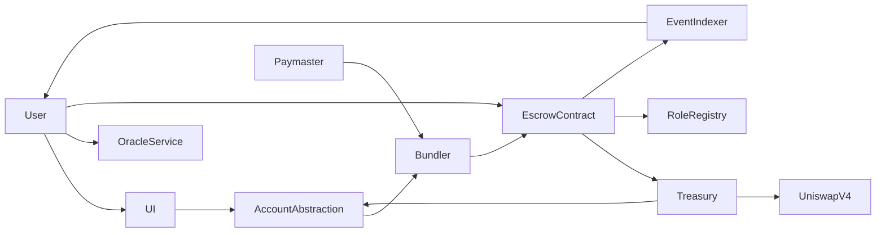

# Contract Safe (Transparent Escrow built for creators)

A **task-based escrow system** for tasks, where contributors submit work, validators approve or reject, and funds are automatically released or refunded. All interactions are **gasless for users** via ERC-4337 account abstraction and a Paymaster.

This repo is structured as a **monorepo**, with separate folders for smart contracts, frontend, and scripts.

---

## Table of Contents

- [Overview](#overview)
- [Features](#features)
- [Architecture](#architecture)
- [Folder Structure](#folder-structure)
- [Getting Started](#getting-started)
- [Usage](#usage)
- [MVP vs Future](#mvp-vs-future)
- [Contributing](#contributing)
- [License](#license)

---

## Overview

This project enables:

- **Gasless interactions**: contributors, validators, and task creators can interact without holding ETH.
- **Escrow for tasks**: funds are locked until a validator approves or rejects.
- **Automatic refunds**: rejected tasks refund the creator automatically.
- **Transparency**: all task states, submissions, approvals, and rejections are recorded on-chain.

---

## Features ( P1 )

- Single-task, single-contributor MVP
- Validator approval or rejection
- Refunds on rejection
- Gasless via ERC-4337 and Paymaster
- Minimal frontend UI for task creation, submission, and validation

---

## Architecture

---

## License

This project is licensed under the MIT License - see the [LICENSE](LICENSE) file for details.
