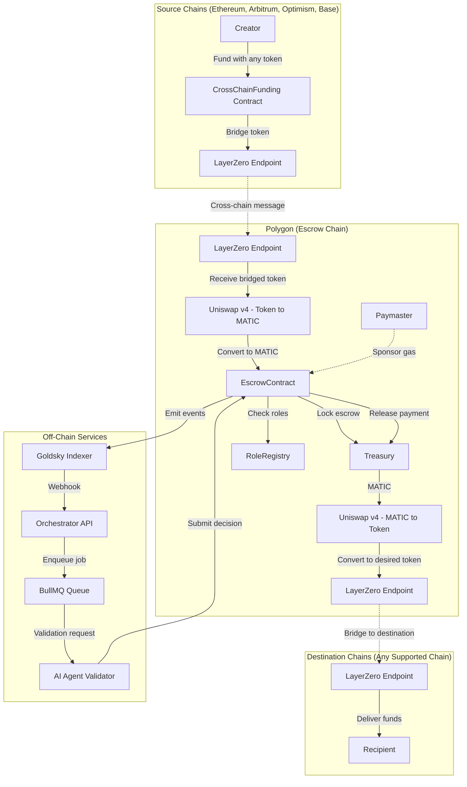

# Contract Safe

A **multi-chain task-based escrow system** built on Polygon, where contributors submit work, validators approve or reject, and funds are automatically released or refunded. Creators can fund tasks from any supported chain (Ethereum, Arbitrum, Optimism, Base), and recipients receive payouts on their preferred chains in their chosen tokens.

**Key Features:**

- **Multi-chain funding**: Create tasks from any supported chain with any token
- **Automatic token conversion**: Uniswap v4 handles all token swaps on Polygon
- **Cross-chain payouts**: Recipients get paid on their preferred chain in their chosen token
- **Gasless interactions**: All user operations are gasless via ERC-4337 and Paymaster
- **Transparent escrow**: All state transitions recorded on-chain and indexed in real-time

---

## Table of Contents

- [Overview](#overview)
- [Multi-Chain Architecture](#multi-chain-architecture)
- [Features](#features)
- [Architecture](#architecture)
- [Folder Structure](#folder-structure)
- [Getting Started](#getting-started)
- [Usage](#usage)
- [Development Scripts](#development-scripts)
- [Contributing](#contributing)
- [License](#license)

---

## Overview

ContractSafe is an event-driven escrow system that combines on-chain deterministic state with off-chain asynchronous workflows. The system is built on **Polygon** for escrow management (lower gas costs) with **LayerZero** for cross-chain bridging and **Uniswap v4** for token conversions.

---

## Multi-Chain Architecture

### Funding Flow (Any Chain → Polygon)

1. **Creator on source chain** (Ethereum, Arbitrum, Optimism, Base) initiates task with their token (ETH, DAI, USDC, WBTC, etc.)
2. **LayerZero bridges** creator's token from source chain to Polygon
3. **Uniswap v4 on Polygon** converts bridged token → MATIC for escrow locking
4. **Escrow locks MATIC** on Polygon until work is approved

**Example:** Creator on Ethereum with 1 ETH → LayerZero bridges ETH to Polygon → Uniswap v4 swaps ETH to MATIC → MATIC locked in escrow

### Payout Flow (Polygon → Any Chain)

1. **Work approved** by validator
2. **Uniswap v4 on Polygon** converts MATIC → recipient's desired tokens (USDC, DAI, ETH, etc.)
3. **LayerZero bridges** tokens to recipient's chosen chains
4. **Recipients receive** funds on their preferred chains in their preferred tokens

**Example:** Contributor wants USDC on Arbitrum → Uniswap v4 swaps MATIC to USDC → LayerZero bridges USDC to Arbitrum

### Supported Chains

- **Escrow Chain**: Polygon (all tasks managed here)
- **Funding Chains**: Ethereum, Arbitrum, Optimism, Base, Polygon
- **Payout Chains**: Ethereum, Arbitrum, Optimism, Base, Polygon

---

## Features

- **Multi-chain task creation**: Fund from any supported chain with any token
- **Automatic token conversion**: Uniswap v4 handles all swaps transparently
- **Cross-chain payouts**: Recipients choose their preferred chain and token
- **Single-task, single-contributor MVP**
- **Validator approval or rejection**
- **Automatic refunds on rejection**
- **Gasless via ERC-4337 and Paymaster**
- **Real-time event indexing** via Goldsky
- **AI agent validator support** via MCP protocol

---

## Architecture



---

## Development Scripts

### 1. Compiling for Environment

#### Compile Protobuf

```bash
# Generate protobuf files for Go API
./script/generate_protobuf
```

#### Compile Smart Contracts

```bash
# Navigate to contract directory
cd contract

# Install dependencies
npm install

# Compile contracts
npx hardhat compile
```

### 2. Deploying Contracts

```bash
# Deploy to local network
cd contract
npx hardhat run scripts/deploy.js --network localhost

# Deploy to testnet (e.g., Sepolia)
npx hardhat run scripts/deploy.js --network sepolia

# Deploy to mainnet
npx hardhat run scripts/deploy.js --network mainnet
```

### 3. Startup Dev Environment

```bash
# Start all services using Docker Compose
docker-compose up

# Or start individual services:

# Start local blockchain node
cd contract
npx hardhat node

# Start API service
cd api
go run main.go

# Start frontend
cd web
npm install
npm run dev
```

---

## License

This project is licensed under the MIT License - see the [LICENSE](LICENSE) file for details.
